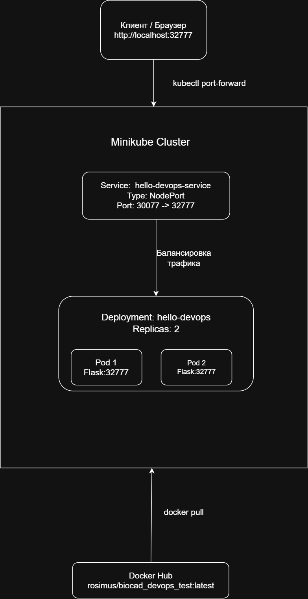
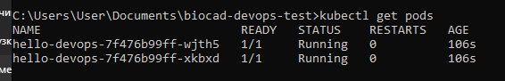
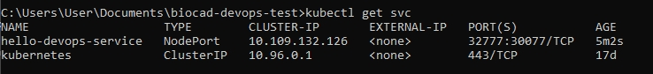
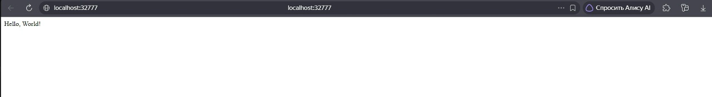

<<<<<<< HEAD
# BIOCAD DevOps Test Task

## 📋 Описание
Веб-приложение "Hello World" на Python (Flask), упакованное в Docker и развёрнутое в Kubernetes (Minikube) с 2 репликами и доступом через NodePort.

## 🛠 Технологии
- **Язык:** Python 3.11
- **Веб-фреймворк:** Flask
- **Контейнеризация:** Docker, Docker Hub
- **Оркестрация:** Kubernetes (Minikube)

## 📁 Структура проекта
biocad-devops-test/
├── app.py # Flask-приложение (порт 32777)
├── requirements.txt # Зависимости Python
├── Dockerfile # Инструкция сборки образа
├── deployment.yaml # Манифест Deployment (2 реплики)
├── service.yaml # Манифест Service (NodePort)
├── architecture.png # Схема архитектуры
├── README.md # Описание проекта
└── screenshots/
├── pods.png # Скриншот с 2 запущенными подами
├── svc.png # Скриншот сервиса NodePort
└── browser.png # Скриншот приложения в браузере

## 🚀 Инструкция по запуску

### 1. Сборка Docker-образа
docker build -t rosimus/biocad_devops_test:latest .

### 2. Публикация образа на Docker Hub
docker login
docker push rosimus/biocad_devops_test:latest

### 3. Запуск Minikube
minikube start --driver=docker

### 4. Применение манифестов Kubernetes
kubectl apply -f deployment.yaml
kubectl apply -f service.yaml

### 5. Проверка статуса
kubectl get pods
kubectl get svc

Ожидаемый результат:
- 2 пода в статусе Running
- Сервис типа NodePort с портом 30077

### 6. Проброс портов
kubectl port-forward service/hello-devops-service 32777:32777

### 7. Проверка в браузере
Откройте http://localhost:32777 — должно отобразиться "Hello, World!"

## 🏗 Архитектура

## 📸 Скриншоты работы

### Поды (2 реплики в статусе Running)

### Сервис (NodePort)

### Приложение в браузере

## ✅ Ответы на теоретические вопросы

**1. Чем git pull отличается от git fetch?**
git fetch скачивает изменения с удалённого репозитория, но не меняет рабочую директорию и локальные ветки. git pull = git fetch + git merge (или rebase), то есть сразу вливает изменения в текущую ветку.

**2. Чем в Linux отличается soft link от hard link? Поведение при удалении оригинала? Можно ли создать hardlink на директорию?**
Soft link (символическая ссылка) — отдельный файл, содержащий путь к оригиналу; при удалении оригинала ссылка «ломается». Hard link — дополнительное имя для того же inode; данные остаются доступны, пока есть хотя бы одна ссылка. Hard link на директорию создать нельзя (только soft link).

**3. Как проверить сетевую доступность между двумя Linux машинами?**
- ping <IP> — проверка ICMP-доступности
- telnet <IP> <порт> или nc -zv <IP> <порт> — проверка TCP-порта
- traceroute <IP> — проверка маршрута
- ss -tuln — просмотр listening-портов на машине

**4. На каких компонентах Linux основана контейнеризация в Docker?**
Namespaces (изоляция процессов, сети, PID, mount), cgroups (ограничение CPU, памяти), UnionFS (слоистая файловая система), capabilities (ограничение привилегий).

**5. Почему вместо "COPY . . / RUN npm install" рекомендуют "COPY package.json / RUN npm install / COPY . ."?**
Для кэширования слоёв Docker: при изменении только исходного кода (но не зависимостей) слой с npm install берётся из кэша, что значительно ускоряет сборку.

**6. Могут ли два контейнера внутри одного пода Kubernetes слушать один и тот же порт?**
Нет. Контейнеры в одном поде используют общее сетевое пространство (один IP и один набор портов), поэтому порты не могут пересекаться.

**7. Какие виды JOIN знаете и чем отличаются?**
- INNER JOIN — только совпадающие строки
- LEFT JOIN — все строки из левой + совпадающие из правой (NULL при отсутствии)
- RIGHT JOIN — все строки из правой + совпадающие из левой
- FULL OUTER JOIN — все строки из обеих таблиц
- CROSS JOIN — декартово произведение

**8. Что такое HAVING в SQL? Чем отличается от WHERE?**
WHERE фильтрует строки до группировки (GROUP BY). HAVING фильтрует сгруппированные строки (по агрегатным функциям: COUNT, SUM, AVG). WHERE не может использовать агрегаты, HAVING — может.

## 🔗 Ссылки
- **Docker Hub:** https://hub.docker.com/r/rosimus/biocad_devops_test
- **GitHub:** https://github.com/Rosimus/biocad-devops-test
=======
# biocad_devops_test
DevOps test task: Hello World app on Docker + Kubernetes (Minikube)
>>>>>>> 426515644ae6b74e068e7602514909a0d351c80a
